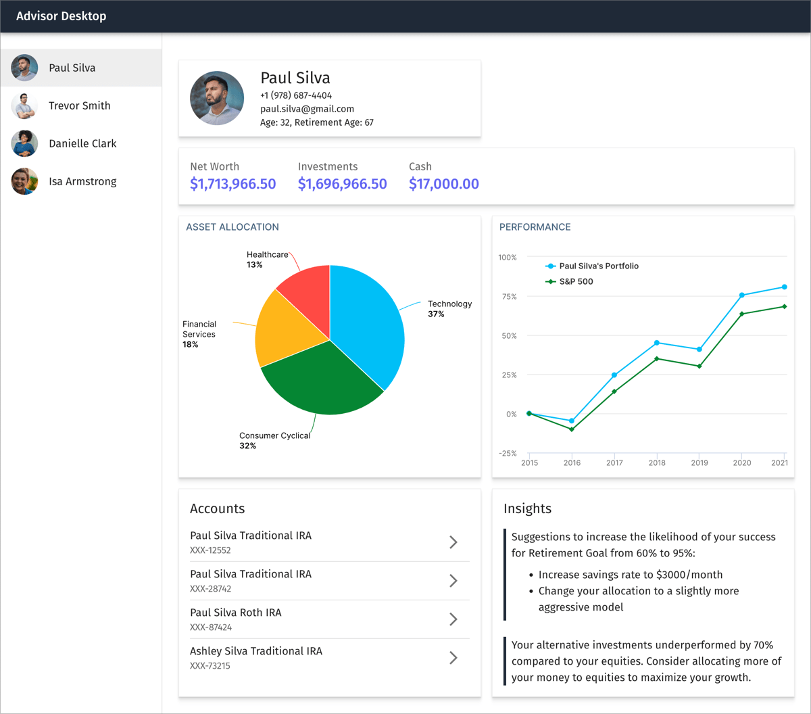

# Advisor Desktop

Sample application to experiment with desktop application integration.

## Development Build

To develop all apps and packages, run the following command:

```
npm install
npm run dev
```

Now point your browser to http://localhost:3000/ to see the monolithic version.

> Note: Do not run `npm install` in any of the subdirectories. It will break the
> build. There should be only one `package-lock.json` file in the entire repo
> (at the root).

## Production Build

To build all apps and packages, run the following command:

```
npm install
npm run build
```

## Screenshots

### Monolithic Version


